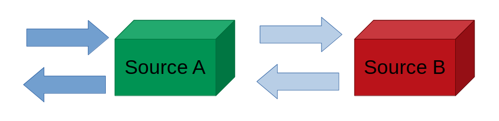

# Data Interchange
> Read/Write fallback and multi-IO handler for several databases/datasources



A data-interchange handler (multi-read and multi-write) for NodeJS. Designed to help work with multiple databases, such as Redis (for fast storage) with MySQL (slow storage). Interchange adapters produced by this library provide `read` and `write` methods to allow to read from and write to all provided _sources_. You can also specify converters to convert subtle differences between formats.

## Usage

Grab the `createInterchange` method from the library to create an adapter. An adapter is basically an array of sources - each source being a R/W call to some data source. Read/Write calls can be synchronous or asynchronous, but the output of the interchange `read` and `write` methods are **always asynchronous**.

An interchanger can take care of a number of data-synchronising tasks in the process of reading and writing. When reading a value, if it is not found in a source, it'll try the next one, up-converting the format until it matches the expected output. It can also write this found value to other sources as it returns it. This is very useful for databases with ephemeral storage - Their datasets can be updated only when required - when a read or write is performed. No extra logic is required to handle this.

### Example

Take the following example - Let's read and write "messages" to multiple sources, each source having a subtle differences in format:

```typescript
import { createInterchange } from "data-interchange";

interface MessageA {
    id: string;
    time: number;
}
interface MessageB {
    id: string;
    ts: number;
}

const readMessageA: (id: string) => MessageA = { /* ... */ };
const readMessageB: (id: string) => MessageB = { /* ... */ };
const writeMessageA: (msg: MessageA) => MessageA = { /* ... */ };
const writeMessageB: (msg: MessageB) => MessageB = { /* ... */ };

const { read, write } = createInterchange([
    {
        read: (id: string) => readMessageA(id),
        write: (msg: MessageA) => writeMessageA(msg),
        readError: (err) => ReadAction.Fallback
    },
    {
        read: (id: string) => readMessageB(id),
        write: (msg: MessageB) => writeMessageB(msg),
        convert: {
            read: (msg: MessageB): MessageA => ({
                id: msg.id,
                time: msg.ts
            }),
            write: (msg: MessageA): MessageB => ({
                id: msg.id,
                ts: msg.time
            })
        }
    }
]);

// Read a message using ID 1
const readMessage: MessageA = await read(1);

// Write a message
const messageToWrite: MessageA = {
    id: 123,
    time: Date.now()
};
await write(messageToWrite);
```

Or if all types are the same:

```typescript
import { WriteMode, createInterchange } from "data-interchange";

const readMessageA: (id: string) => MessageA = { /* ... */ };
const readMessageB: (id: string) => MessageA = { /* ... */ };
const writeMessageA: (msg: MessageA) => MessageA = { /* ... */ };
const writeMessageB: (msg: MessageA) => MessageA = { /* ... */ };

createInterchange([
    {
        read: (id: string) => readMessageA(id),
        write: (msg: MessageA) => writeMessageA(msg),
        readError: (err) => ReadAction.Fallback
    },
    {
        read: (id: string) => readMessageB(id),
        write: (msg: MessageA) => writeMessageB(MessageA)
    }
], { writeMode: WriteMode.Parallel });
```

### Delayed writes

You can delay writes in certain sources by using the `writeWait` property. Setting it to `true` on a source will result in each write to a source to return immediately, with the writing occuring in the background.

_If you expect reads to happen on the same source, you should use queues to prevent race conditions._

### Queuing

Reads and writes can be queued so that, even if a read and a write occur almost simultaneously, data is read and written in order, even asynchronously.

For queuing to work on a source, specify either `queueReadKey` or `queueWriteKey`, or both. Although you can set them separately, you will mostly need to set them to the **same key** per resource (unique item). Reads use the `queueReadKey` while writes use the `queueWriteKey`, so if a queue is to block reads on a resource that's currently being written to, they should match.

Both of these keys can either be a `string`, or a function that returns a `string`. The function must be synchronous. The function will be provided the item being written or the ID being read.

Example:

```typescript
const source = {
    read: () => { /* ... */ },
    write: () => { /* ... */ },
    queueReadKey: (id: string) => `item:${id}`,
    queueWriteKey: (item: { id: string }) => `item:${item.id}`
}
```

You can also provide your own queue using an option:

```typescript
createInterchange([], { queue });
```

Queues can be created by using `createQueue`, but are essentially `ChannelQueue` instances from [`@buttercup/channel-queue`](https://github.com/buttercup/channel-queue).
